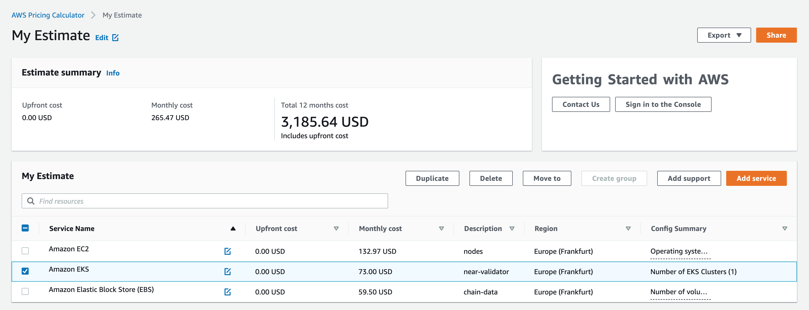

# NEAR Stake Wars III AWS Cloud Validator 

* [Requirements](#requirements)
* [AWS Setup](#aws-setup)
* [Kubernetes Monitoring](#kubernetes-monitoring)
* [NEAR Validator](#near-validator)
* [Cost Calculation](#cost-calculation)

## Requirements

[aws-cli](https://docs.aws.amazon.com/cli/latest/userguide/getting-started-install.html)
[docker](https://docs.docker.com/engine/install/)
[eksctl](https://docs.aws.amazon.com/eks/latest/userguide/eksctl.html)
[helm](https://helm.sh/docs/intro/install/)
[near-cli](https://github.com/near/near-cli)

## AWS Setup

### Create ECR repository for storing near-validator docker image

```
aws ecr create-repository --repository-name near-stake-wars-iii
```

### Authorize docker in your AWS ECR service (change <<AWS_ACCOUNT_ID>> to your own one)

```
aws ecr get-login-password | docker login --username AWS --password-stdin <<AWS_ACCOUNT_ID>>.dkr.ecr.region.amazonaws.com
```

### Build near-validator docker image and push it to your ECR

```
docker build -t <<AWS_ACCOUNT_ID>>.dkr.ecr.region.amazonaws.com/near-stake-wars-iii:latest .
docker push <<AWS_ACCOUNT_ID>>.dkr.ecr.region.amazonaws.com/near-stake-wars-iii:latest
```

### Create a EKS cluster using a config file 

```
eksctl create cluster -f deploy/eks/cluster.yaml
```

### Update your KUBECONFIG with access to new cluster

```
aws eks update-kubeconfig --name near-stake-wars-iii
```


## Kubernetes Monitoring

### Create kubernetes namespace where you want to deploy all the staff

```
kubectl create namespace near
```

### Prepare the Prometheus monitoring stack into your cluster

```
helm repo add prometheus-community https://prometheus-community.github.io/helm-charts
helm repo update
```

### Install Kube Prometheus stack (it deploy prometheus and grafana to your cluster)

```
helm install --namespace near -f deploy/kube-prometheus.yaml monitoring prometheus-community/kube-prometheus-stack
```

### Apply the grafana dashboard that will be uses for Validator monitoring

```
kubectl -n near apply -f deploy/grafana-dashboard.yaml
```


## NEAR Validator

In order to run the validator you must have 3 different key-pairs: 

- node_key (used for peer-to-peer connection between nodes)
- account_key (used for deploy/interact with the pool contract)
- validator_key (used for sign produced blocks/chunks)

### Setup NEAR network ID

```
export NEAR_ENV=shardnet
```

### Generate node key

```
docker run --rm --entrypoint sh nearprotocol/nearcore:master -c "neard init && cat /root/.near/node_key.json"
```

### Get your wallet full access key (https://github.com/near/stakewars-iii/blob/main/challenges/002.md#activating-the-node-as-validator)

```
export ACCOUNT_ID=<<YOUR_ACCOINT_ID>>
near login
cat ~/.near-credentials/${NEAR_ENV}/${ACCOUNT_ID}.json
```

> Note: This command launches a web browser allowing for the authorization of a full access key to be copied locally.

### Generate validator key

```
export POOL_ID=<<YOUR_POOL_ID>>
near generate-key ${POOL_ID}
cat ~/.near-credentials/${NEAR_ENV}/${POOL_ID}.json
```

> Note: <YOUR_POOL_ID> ---> xx.factory.shardnet.near WHERE xx is you pool name

### Upload generated key-pairs to kubernetes namespace accordingly to its purposes (in the following pattern)

```
kubectl -n near create secret generic stake-wars-iii-service-secrets \
  --from-literal=NODE_0_ACCOUNT_ID=near_validator \
  --from-literal=NODE_0_PUBLIC_KEY=ed25519:85NnY2mLgjZb17Uk1HJwAoWGfA95VwfPveExAN7VPT9G \
  --from-literal=NODE_0_SECRET_KEY=ed25519:*** \
  --from-literal=WALLET_0_ACCOUNT_ID=near_validator \
  --from-literal=WALLET_0_PUBLIC_KEY=ed25519:4uY8taad3456ByHawr2B8zo8RtN2UKspaDLYb145LwHVT \
  --from-literal=WALLET_0_PRIVATE_KEY=ed25519:*** \ 
  --from-literal=VALIDATOR_0_ACCOUNT_ID=near_validator.factory.shardnet.near \
  --from-literal=VALIDATOR_0_PUBLIC_KEY=ed25519:HeaBJ3xLgvZacQWmEctTeUqyfSU4SDEnEwckWxd92W2G \
  --from-literal=VALIDATOR_0_SECRET_KEY=ed25519:****
```

### Now its time to deploy validator node to kubernetes cluster

```
helm install --namespace near -f deploy/near-validator \
	--set containerImage.repository=<<AWS_ACCOUNT_ID>>.dkr.ecr.region.amazonaws.com/near-stake-wars-iii \
	--set containerImage.tag=latest \
	stake-wars-iii ./helm-chart 
```

### In a while you will see the Running pods with validator node

```
╰─➤  kubectl -n near get pods
NAME               READY   STATUS    RESTARTS   AGE
stake-wars-iii-0   3/3     Running   0          5m
```

### Deploy a Staking Pool Contract

Calls the staking pool factory, creates a new staking pool with the specified name, and deploys it to the indicated accountId.

```
near call factory.shardnet.near create_staking_pool '{"staking_pool_id": "<pool id>", "owner_id": "<accountId>", "stake_public_key": "<public key>", "reward_fee_fraction": {"numerator": 5, "denominator": 100}, "code_hash":"DD428g9eqLL8fWUxv8QSpVFzyHi1Qd16P8ephYCTmMSZ"}' --accountId="<accountId>" --amount=30 --gas=300000000000000
```

From the example above, you need to replace:

* **Pool ID**: Staking pool name, the factory automatically adds its name to this parameter, creating {pool_id}.{staking_pool_factory}
* **Owner ID**: The SHARDNET account (i.e. stakewares.shardnet.near) that will manage the staking pool.
* **Public Key**: The public key in your **validator_key.json** file.
* **5**: The fee the pool will charge (e.g. in this case 5 over 100 is 5% of fees).
* **Account Id**: The SHARDNET account deploying and signing the mount tx.  Usually the same as the Owner ID.

### Once everything deployed correctly you may see the status of your validator node onto grafana dashboard

```
kubectl -n near port-forward svc/grafana 8080:80
```

> Open the browser URL: http://127.0.0.1:8080 and navigate to grafana dashboard "NEAR / Validators"


## Cost Calculation

Expected AWS resources required for this setup:
- 1x EKS cluster `73$/monthly`
- 1x EC2 node (c5a.xlarge with 4 CPU and 8GB memory) `133$/monthly`
- 1x EBS volume (500GB) `60$/monthly`


